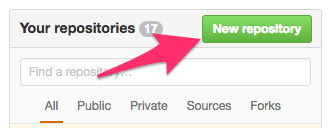
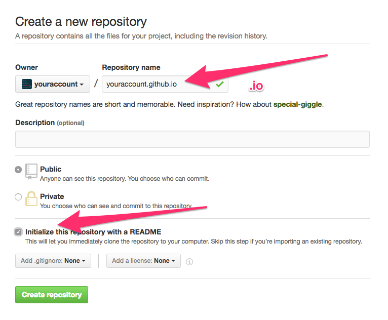
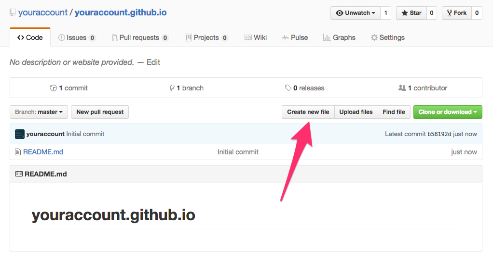
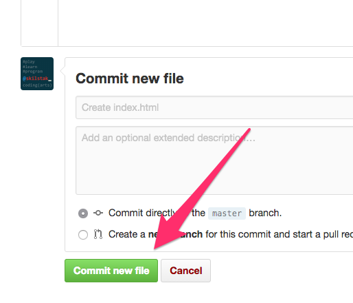
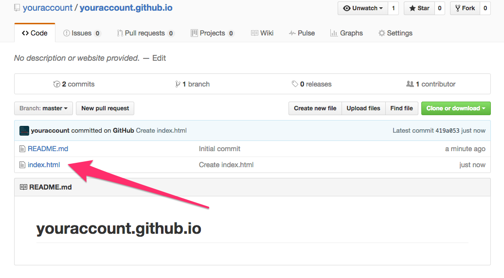
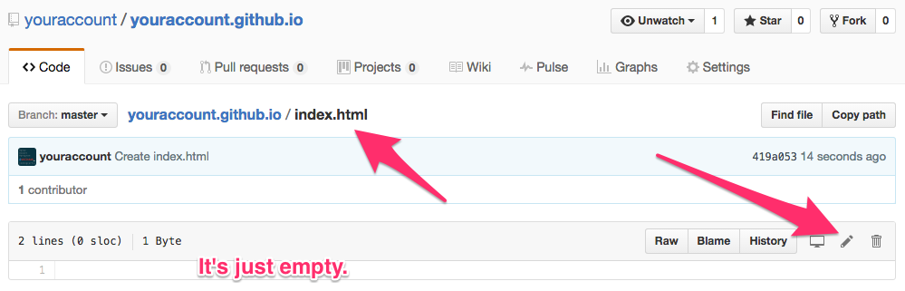
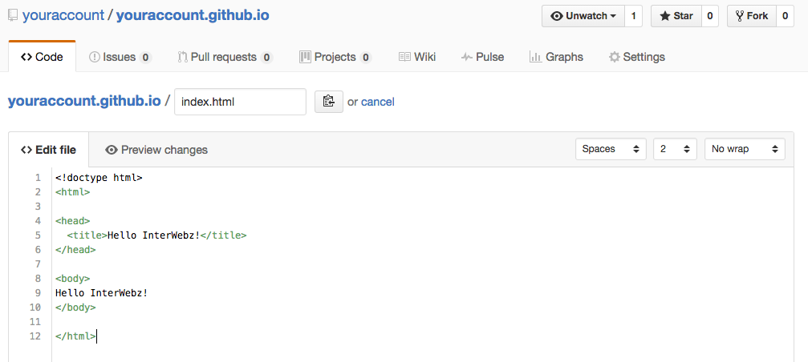
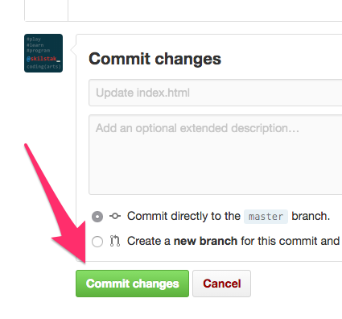
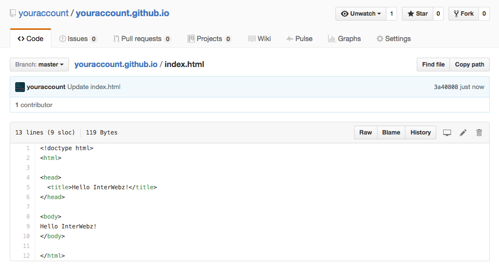
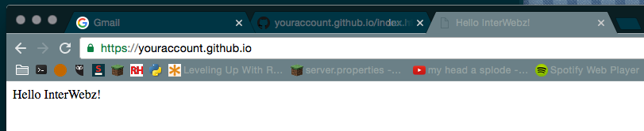

# Create Your First Web Site

You should have already [created the GitHub repo for web site][web] when you
created your GitHub account. If not, go back and do that.

[web]: https://github.com/skilstak/prep/blob/gh-pages/github.md#ok-now-create-a-project-repo

## Update Your `index.html` File

You should already have one. If not you'll have to [go make one][web].
The one we made when we created our GitHub account just had plain old
text in it. We are going to get a little fancy here, but nothing too
crazy.

---

[][cc-by-sa]
[][skilstak]
[cc-by-sa]: https://creativecommons.org/licenses/by-sa/4.0/
[skilstak]: http://skilstak.io

